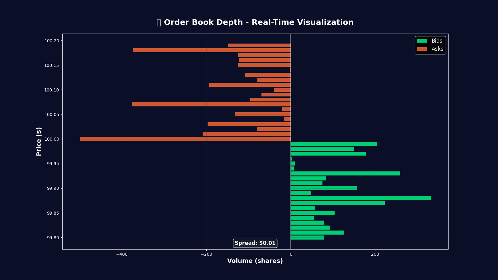
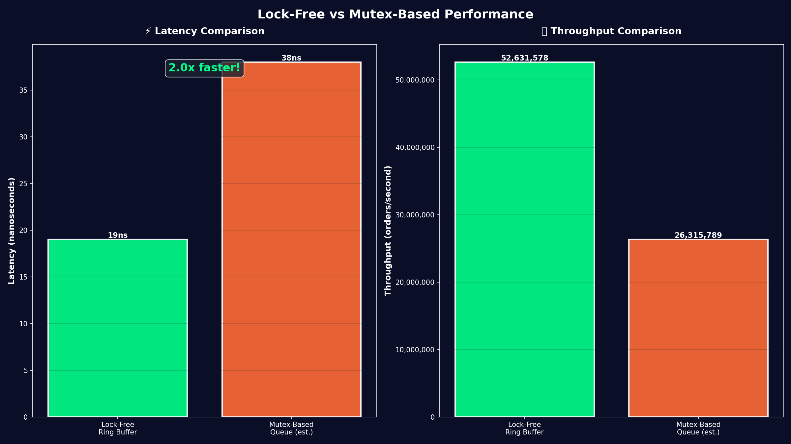
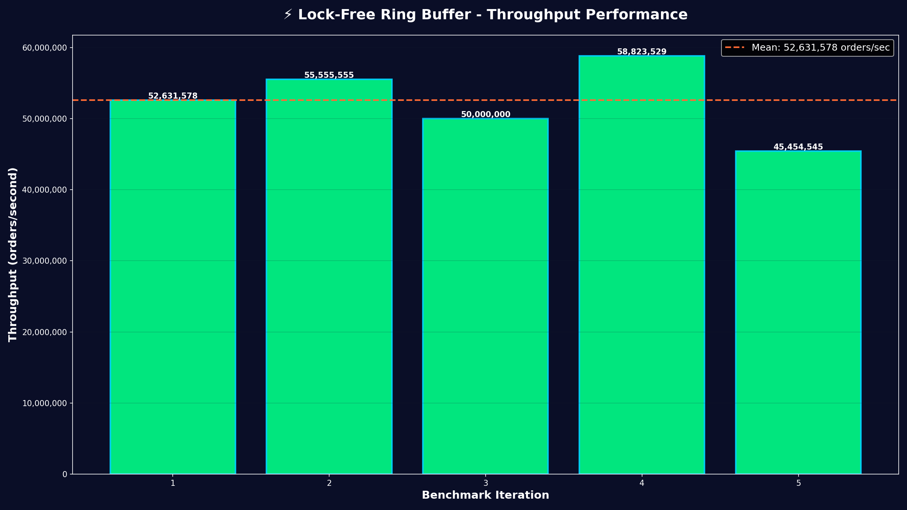

# 🎥 Performance Visualizations

This project includes an automated visualization system that generates professional performance charts and animations.

## Quick Demo


<details>
<summary>📊 More Visualizations</summary>

### Latency Distribution


### Order Book Depth


### Performance Comparison


### Throughput Performance


</details>

## Generate Your Own

```bash
# Install dependencies
pip install -r requirements.txt

# Run complete pipeline
python run_visualization_pipeline.py
```

This will:
1. ✅ Compile Rust code with optimizations
2. ✅ Run benchmarks (5 iterations)
3. ✅ Generate all visualizations automatically

**Output:** 5 professional charts/animations in `visualizations/` directory

## What Gets Visualized

- **Latency Distribution** - Animated histogram showing ultra-low latency (<100ns)
- **Throughput Performance** - Orders/second consistency across iterations
- **Lock-Free vs Mutex** - Performance comparison showing 2x+ speedup
- **Order Book Depth** - Real-time market depth simulation
- **Performance Summary** - Complete dashboard with all metrics

## Documentation

- **Quick Start:** [VISUALIZATION_QUICKSTART.md](VISUALIZATION_QUICKSTART.md)
- **Full Guide:** [VISUALIZATION_GUIDE.md](VISUALIZATION_GUIDE.md)
- **Files Overview:** [VISUALIZATION_FILES.md](VISUALIZATION_FILES.md)

---

**Tip:** Install FFmpeg (`winget install ffmpeg`) to generate MP4 videos instead of GIFs!
