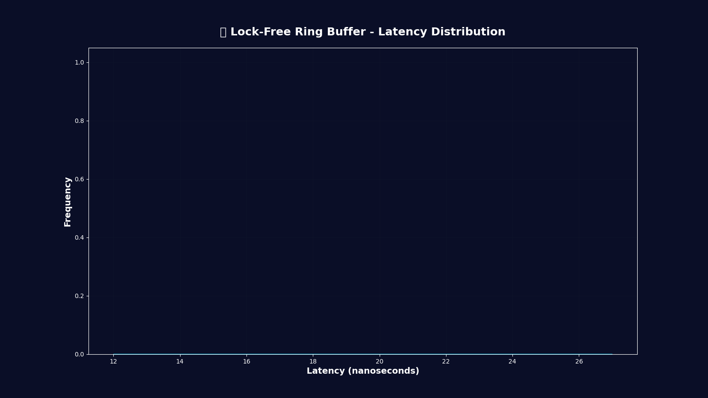
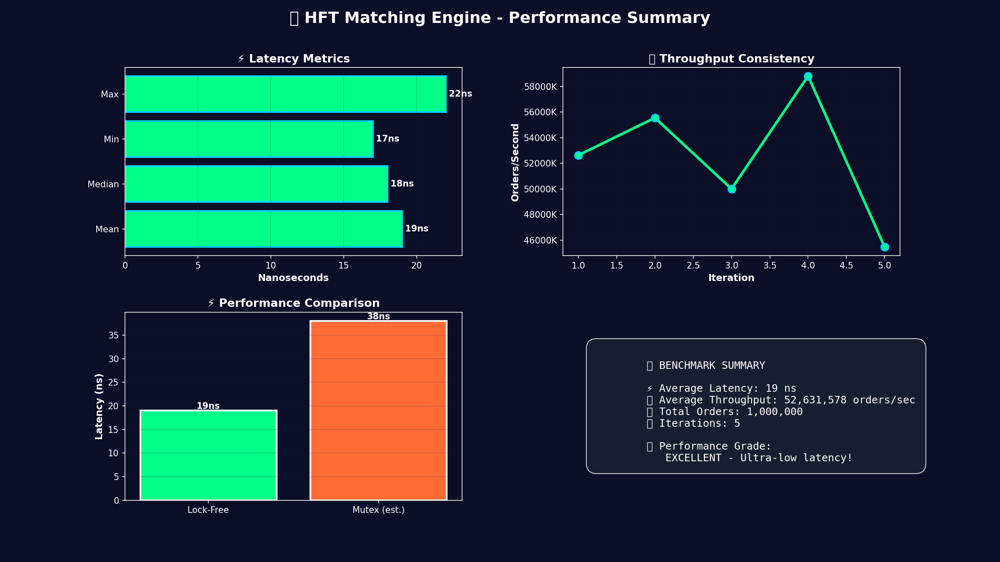

# 🎥 How to Generate Preview Videos

This project includes a complete visualization pipeline that generates animated performance charts and demo videos showcasing the HFT matching engine's capabilities.

## 🚀 Quick Start

### 1. Install Python Dependencies

```bash
pip install -r requirements.txt
```

### 2. Generate Visualizations

**Option A: Complete Pipeline (Recommended)**
```bash
python run_visualization_pipeline.py
```

This will:
1. Compile your Rust code with release optimizations
2. Run benchmarks (5 iterations)
3. Generate all visualizations automatically

**Option B: Use Existing Benchmark Data**
```bash
# If you already have benchmark_data.json
python visualize.py
```

**Option C: Step-by-Step**
```bash
# 1. Run benchmarks only
python benchmark_runner.py

# 2. Generate visualizations
python visualize.py
```

## 📹 Generated Outputs

All files are saved to the `visualizations/` directory:

### Animated Visualizations
- **`latency_distribution.gif`** - Animated histogram showing latency distribution
- **`orderbook_depth.gif`** - Real-time order book depth visualization

### Static Charts
- **`throughput_chart.png`** - Throughput performance across iterations
- **`comparison_chart.png`** - Lock-free vs Mutex performance comparison  
- **`performance_summary.png`** - Comprehensive summary dashboard

### Data Files
- **`benchmark_data.json`** - Raw benchmark metrics for custom analysis

## 🎬 Upgrading to MP4 Videos

For higher quality MP4 videos instead of GIFs:

### Install FFmpeg

**Windows:**
```bash
winget install ffmpeg
```

**Or download from:** [ffmpeg.org](https://ffmpeg.org/download.html)

**Verify installation:**
```bash
ffmpeg -version
```

Once FFmpeg is installed, re-run the visualization tool:
```bash
python visualize.py
```

It will automatically detect FFmpeg and generate MP4 files instead of GIFs!

## 📊 What Gets Visualized

### 1. **Latency Distribution** 
Animated histogram showing:
- Distribution of order processing latency
- Mean, median, min, max values
- Standard deviation
- Ultra-low latency performance (<100ns)

### 2. **Throughput Performance**
Bar chart displaying:
- Orders/second across benchmark iterations
- Consistency of performance
- Mean throughput line
- Peak performance metrics

### 3. **Lock-Free vs Mutex Comparison**
Side-by-side comparison showing:
- Latency comparison (nanoseconds)
- Throughput comparison (orders/sec)
- Performance speedup factor
- Estimated mutex overhead

### 4. **Order Book Depth**
Animated visualization of:
- Real-time bid/ask order book
- Volume distribution across price levels
- Spread indicator
- Market depth dynamics

### 5. **Performance Summary**
Comprehensive dashboard with:
- All key latency metrics
- Throughput consistency graph
- Performance comparison
- Benchmark statistics
- Performance grade

## 🎯 Embedding in README

### GitHub README

```markdown
## Performance Demo




```

### For Portfolio/Website

```html

```

## 🔧 Customization

### Adjust Benchmark Parameters

Edit `benchmark_runner.py`:
```python
# Change number of iterations
results = runner.run_benchmark(iterations=10)
```

### Customize Visual Style

Edit `visualize.py`:
```python
# Change color scheme
COLORS = {
    'primary': '#00ff88',    # Your color
    'secondary': '#00d4ff',  # Your color
    # ...
}

# Adjust figure size
fig, ax = plt.subplots(figsize=(20, 12))  # Larger

# Change animation duration
anim = animation.FuncAnimation(fig, animate, frames=120)  # More frames
```

### Export Different Formats

```python
# High-resolution PNG
plt.savefig(output_path, dpi=300, format='png')

# Vector graphics (SVG)
plt.savefig(output_path, format='svg')

# PDF for papers/presentations
plt.savefig(output_path, format='pdf')
```

## 📈 Performance Tips

- **Faster generation**: Reduce animation frames (e.g., `frames=30`)
- **Smaller files**: Lower bitrate for MP4 (e.g., `bitrate=1500`)
- **Higher quality**: Increase DPI for PNG (e.g., `dpi=300`)

## 🐛 Troubleshooting

### "FFmpeg not found"
- Install FFmpeg: `winget install ffmpeg`
- Or use GIF output (works without FFmpeg)

### "No module named 'matplotlib'"
```bash
pip install -r requirements.txt
```

### "Benchmark data not found"
Run benchmarks first:
```bash
python benchmark_runner.py
```

### Videos won't play
- Try different video player (VLC, MPV)
- Re-generate with different codec
- Use GIF format instead

## 📁 File Structure

```
HFT-2/
├── requirements.txt              # Python dependencies
├── benchmark_runner.py           # Runs Rust benchmarks
├── visualize.py                  # Generates visualizations
├── run_visualization_pipeline.py # Complete pipeline
├── benchmark_data.json           # Benchmark results
└── visualizations/               # Output directory
    ├── latency_distribution.gif
    ├── orderbook_depth.gif
    ├── throughput_chart.png
    ├── comparison_chart.png
    └── performance_summary.png
```

## 🎓 Next Steps

1. ✅ Generate visualizations
2. 📤 Upload to GitHub repository
3. 📝 Embed in README.md
4. 🌐 Share on LinkedIn/portfolio
5. 🎥 Create demo video for presentations
6. 📊 Use in technical interviews

---

**Need help?** Check the main [README.md](README.md) or open an issue!
